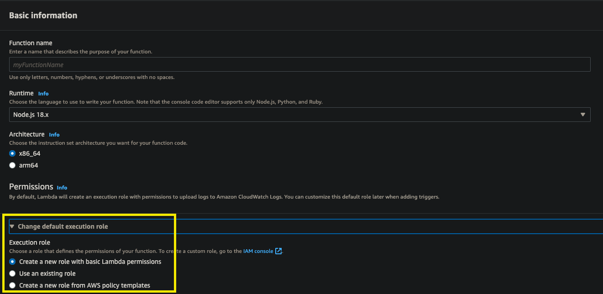
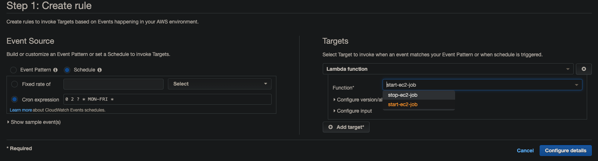

# README

<p align="left">
  <a  href="https://github.com/mt5718214/forum-front-end-vue">Check Out Front-end Repository</a>
</p>

## Initialize
```
git clone https://github.com/mt5718214/forum-backend.git
cd forum-express
npm install
npx sequelize db:migrate
npx sequelize db:seed:all
npm run dev
```

## User stories

**前台**

* 使用者可以註冊/登入/登出網站
* 使用者可以瀏覽所有餐廳與個別餐廳詳細資料
* 在瀏覽所有餐廳資料時，可以用分類篩選餐廳
* 使用者可以對餐廳留下評論
* 使用者可以收藏餐廳
* 使用者可以查看最新上架的 10 筆餐廳
* 使用者可以查看最新的 10 筆評論
* 使用者可以編輯自己的個人資料
* 使用者可以查看自己評論過、收藏過的餐廳
* 使用者可以追蹤其他的使用者
* 使用者可以查看自己追蹤中的使用者與正在追蹤自己的使用者
* 與其他使用者群聊

|  account   | password  |
|  ----  | ----  |
| user1@example.com  | 12345678 |
| user2@example.com  | 12345678 |

**後台**

* 只有網站管理者可以登入網站後台
* 網站管理者可以在後台管理餐廳的基本資料
* 網站管理者可以在後台管理餐廳分類

|  account   | password  |
|  ----  | ----  |
| root@example.com  | 12345678 |


## Auto Start or Stop EC2 by Lambda and CloudWatch

**Create Lambda and create role**


**Grant role permission to modify EC2 & write log**
```
{
  "Version": "2012-10-17",
  "Statement": [
    {
      "Effect": "Allow",
      "Action": [
        "logs:CreateLogGroup",
        "logs:CreateLogStream",
        "logs:PutLogEvents"
      ],
      "Resource": "arn:aws:logs:*:*:*"
    },
    {
      "Effect": "Allow",
      "Action": [
        "ec2:Start*",
        "ec2:Stop*"
      ],
      "Resource": "*"
    }
  ]
}
```

**Using *@aws-sdk/client-ec2* module to start or stop EC2**
```javascript
// https://docs.aws.amazon.com/AWSJavaScriptSDK/v3/latest/clients/client-ec2/index.html

import { EC2 } from '@aws-sdk/client-ec2';
const client = new EC2({ region: "your region" });

const params = {
  InstanceIds: [
     "your ec2 instanceID"
  ]
 }

export const handler = async (event) => {
   try {
      /** 
       * you need to create two lambda, one for start and the other for stop
      */

      // stop instances
      const res = await client.stopInstances(params)
      console.log(res)

      // start instances
      const res = await client.startInstances(params)
      console.log(res)

      const response = {
          statusCode: 200,
          body: JSON.stringify(data),
      };
      
      return response;
    } catch (error) {
      const response = {
          statusCode: 400,
          body: JSON.stringify(error),
      };
      return response;
    }
};
```

**Using CloudWatch to trigger lambda**


* for **Event Source** I wanna EC2 to start at 10:00(UTC+8) MON-FRI.
* for **Targets** choose the lambda you create before.